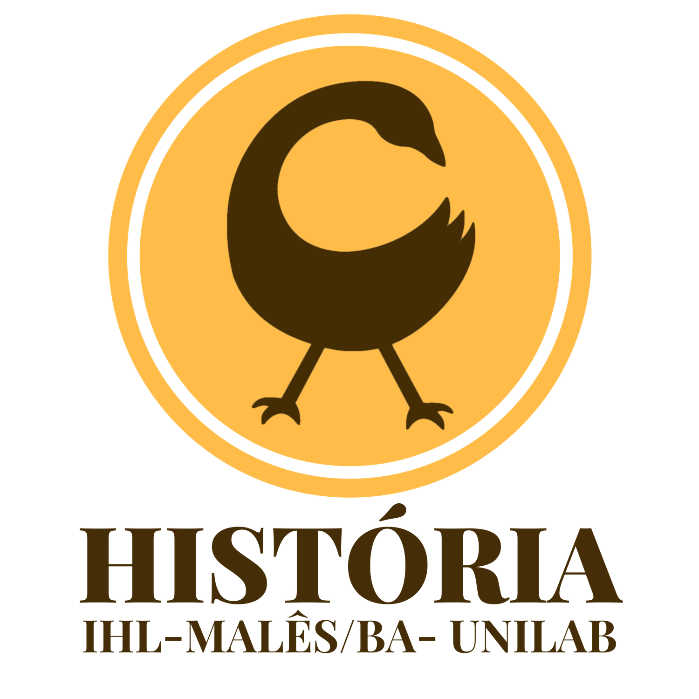

layout: true

```{r setup, include=FALSE}
options(htmltools.dir.version = FALSE)

knitr::opts_chunk$set(
	echo = FALSE,
	fig.align = "center",
	message = FALSE,
	warning = FALSE,
	cache = FALSE
)
```

```{r eval=FALSE, include=FALSE}
library(knitr)
library(tidyverse)
library(widgetframe)
```
---
class: bg_green, center, middle

# Como é que se começa um projeto em história atualmente?

---
class: bg_yellow, center, middle

### - Suas fontes são digitais ou digitalizadas?
<br>

--
### - Você já possui ou criou uma versão legível por computador dos seus dados.
<br>

--
### - Você já comprendeu "como suas fontes digitais foram criadas, e como ficaram disponíveis para você" (BLANEY, et al. 2021. p. 44)

---
class: bg_green, center, middle

# E o que isso tem a ver com Humanidades Digitais?

---
class: bg_yellow, center, middle

## Longa história das tecnologias com as pesquisas em Humanidades
<br>

--
### -  Index Thomisticus
<br>

--
### - Computadores e Humanidades antes das Humanidades Digitais

---
class: bg_green, center, middle

# Voltando para a História, onde estamos nessa conversa?

---
class: bg_yellow, center, middle

## Muitas histórias ao longo do século XX e XXI
<br>

--
### - [Technology and the Historian: Transformations in the Digital](https://www.press.uillinois.edu/books/?id=p085697) Age de Adam Crymble

---
class: bg_yellow, center, middle

## Ok, mas hoje somos todos historiadores digitais?
<br>

--
### - [The Transformation of Historical Research in the Digital Age](https://www.cambridge.org/core/elements/transformation-of-historical-research-in-the-digital-age/30DFBEAA3B753370946B7A98045CFEF4#) de Ian Milligan

---
class: bg_green, center, middle
# O oceano de dados está aqui. Como encontrar algo relevante?
<br>
```{r, out.width="50%"}
knitr::include_graphics("https://i.giphy.com/media/Xch9I90tRezyicQgma/giphy.webp")
```

---
class: bg_yellow, center, middle

## Como coletamos e organizamos nossos dados?
<br>

--
### - CSV, JSON, XML, TEI, RDF
<br>

--
### - PDF, JPG
<br>

--
### - Como lidar com esses diferentes formatos?
<br>

--
### - Metadados? Navegar, descobrir e organizar. Mas também um objeto em si mesmo (BLANEY, et al. 2021. p. 61)

---
class: bg_yellow, center, middle

## Compreender esse processo deve ser tarefa básica em nossa profissão.

---
class: bg_yellow, center, middle

### "Os métodos de pesquisa digital criam demandas novas e às vezes mais rigorosas de precisão, pensamento metodológico, auto-organização e colaboração do que a pesquisa histórica tradicional" (FRIDLUND; OIVA; PAJU, 2020, pos. 543).

---
class: bg_yellow, center, middle

## Letramento Arquivístico Digital
<br>

### "O Letramento arquivístico digital requer a compreensão de como a produção de arquivos digitais se baseia em designs técnicos que influenciam a sua usabilidade. Isso significa que (todos) os historiadores precisam adquirir competência digital em um nível profissional paralelo às habilidades que temos em compreender como a classificação e categorização de fontes afetam nossa interação com arquivos analógicos e moldam nossas questões de pesquisa. (JENSEN, 2021, p. 6)"

---
class: bg_yellow, center, middle

## Como gerenciar seus dados e mantê-los seguros?
<br>

--
### - Metadados (como você descreve seus dados, tanto internamente quanto externamente)
<br>

--
### - Controle de versões (o que fazer se você fizer uma lambança no processo)
<br>

--
### - Documentação (uma descrição narrativa do projeto)
<br>

--
### - Preservação (como os dados podem ser mantidos para uso no futuro)

---
class: bg_yellow, center, middle

## Colaboração, abertura, compartilhamento

---
class: bg_green, middle, center

# Seremos todos programadores?

---
class: bg_yellow, middle, center

### - O digital substituirá as ferramentas básicas da operação historiográfica?
<br>

--
### - Como isso afeta a construção do conhecimento histórico?

---
class: bg_yellow, middle, center

## Acesse a biblioteca de referências **História Digital** no Zotero, [clicando aqui](https://www.zotero.org/groups/2216280/histria_digital/library).
---
class: bg_yellow, middle, center

## Eric Brasil
<br>

### Email: [ericbrasiln@proton.me](mailto:ericbrasiln@proton.me)

### GitHub: [ericbrasiln](https://github.com/ericbrasiln/)

### Twitter: [ericbrasiln](http://www.twitter.com/ericbrailn) 

### [Orcid](https://orcid.org/0000-0001-5067-8475) - [Lattes](http://lattes.cnpq.br/6853705640900524)

### [Site pessoal](https://ericbrasiln.github.io)

---
class: bg_yellow, middle, center

```{r, out.width="25%"}

```

## Curso de Licenciatura em História

### Instituto de Humanidades e Letras do campus dos Malês, Unilab

### [Site do curso](historia.males.unilab.edu.br/) 

### email: [historia.ba@unilab.edu.br ](mailto:historia.ba@unilab.edu.br)

```{r, out.width="22%"}
knitr::include_graphics("img/logo_unilab.png", error=FALSE)
```

---
class: bg_yellow, middle, center

```{r, out.width="20%"}
knitr::include_graphics("img/logo_MA_color.png", error=FALSE)
```

## Laboratório de Humanidades Digitais da UFBA

### Twitter: [labhdufba](https://twitter.com/labhdufba) 

### Instagram: [labhdufba](http://instagram.com/labhdufba)

### Github: [https://github.com/LABHDUFBA](https://github.com/LABHDUFBA)

---
class: title-slide-final, middle, center

# Obrigado, gente!

.pull-left[
<br>

## Agradecimentos especiais:
<br> 

## À Cristina Maria Dadalto pelo convite e ao público pela escuta e debate.
]

.pull-right[
```{r, out.width="90%"}
knitr::include_graphics("https://media1.giphy.com/media/3o6wNIV9FP28JIleyk/giphy.gif?cid=790b761122702fc03784413d1e84fbe31a5613b955b9bf24&rid=giphy.gif&ct=g")
```
]